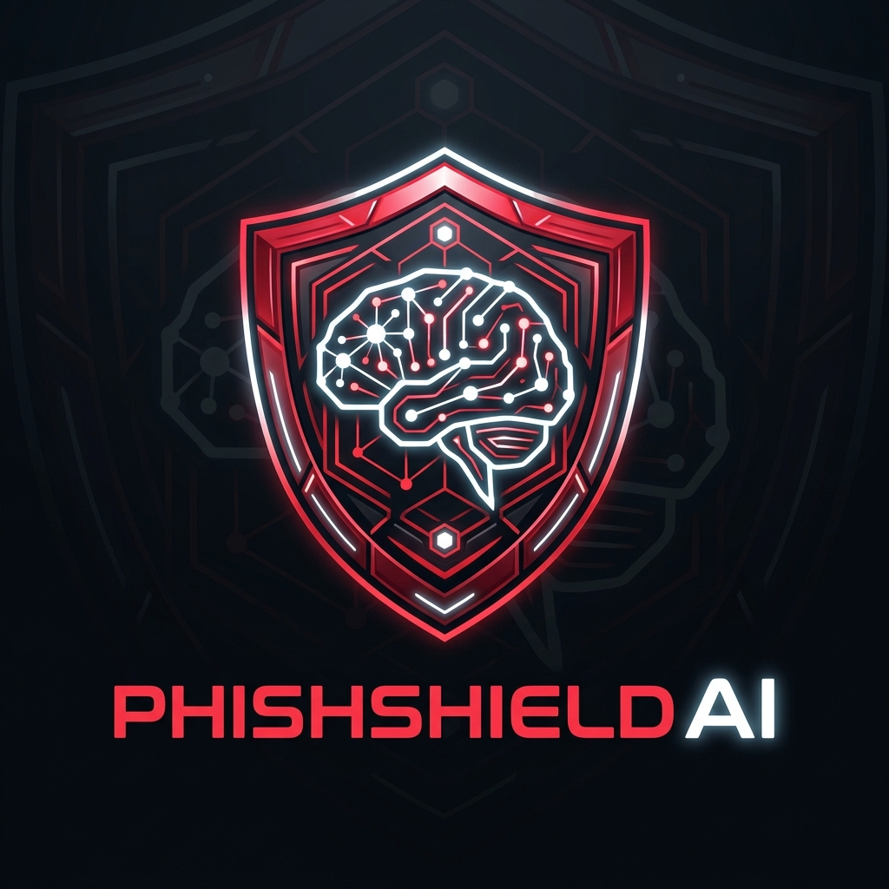
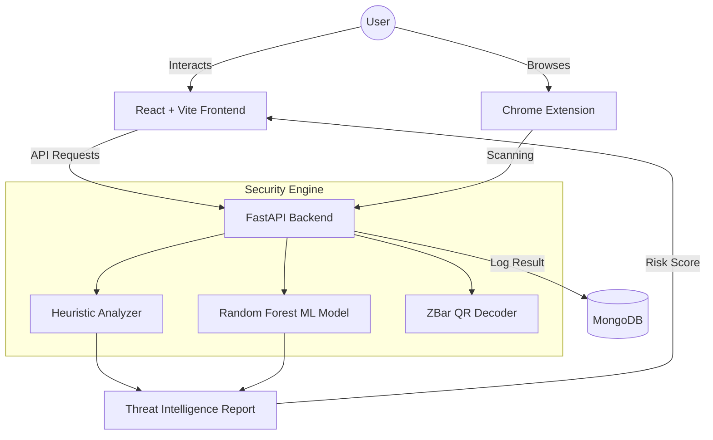

<p align="center">
  
</p>

<h1 align="center">PhishShield AI</h1>

<p align="center">
  <strong>Advanced Cybersecurity Intelligence Platform for Phishing & Scam Detection</strong>
</p>

<p align="center">
  <a href="https://phish-shield-ai-psi.vercel.app/" target="_blank">
    
  </a>
</p>

<p align="center">
  
  
  
  
  
</p>

---

## 🛡️ Project Overview

**PhishShield AI** is a state-of-the-art cybersecurity platform engineered to identify and mitigate phishing threats across multiple vectors. By leveraging machine learning and advanced heuristic analysis, PhishShield provides users with real-time protection against malicious URLs, fraudulent emails, and suspicious QR codes.

The project implements a "Red Alert" threat intelligence aesthetic, designed to provide high-visibility security alerts and a comprehensive dashboard for threat monitoring.

## 🌐 Deployed Application

The platform is live-hosted and deployed on Vercel:
🔗 **[https://phish-shield-ai-psi.vercel.app](https://phish-shield-ai-psi.vercel.app)**

> [!NOTE]
> Google Sign-In authentication is active. To perform scans, authenticate with your Google account. Authorized admin accounts (e.g., `arorajivaj3009@gmail.com`) can view the global dashboard with full scan logs.

## 🚀 Key Features

- **🔍 Intelligent URL Scanner**: Analyzes URLs using a combination of heuristic patterns (entropy, structure, obfuscation) and a trained **Random Forest Classifier**.
- **📧 Email & Text Analyzer**: Detects psychological manipulation, urgency-based social engineering, and hidden malicious links in email content.
- **📱 Secure QR Scanner**: Decodes QR codes and automatically performs a security audit on the extracted destination URL to prevent "Quishing" (QR Phishing).
- **🌐 Chrome Extension**: Real-time browser protection that scans pages as you browse and alerts you to potential threats.
- **📊 Security Dashboard**: A centralized hub for monitoring threat history, risk scores, and detailed breakdown of detected vulnerabilities.

## 🏗️ Architecture



## 🛡️ Cybersecurity Highlights & Requirements

This project successfully implements critical cybersecurity tools and requirements:

- **AI-Powered Detection**: Utilization of `Scikit-learn` to train a model on phishing datasets, enabling predictive detection beyond static blacklists.
- **Heuristic Threat Intel**: Custom-built engine to detect common phishing patterns (HTTP vs HTTPS, @ symbols, suspicious keywords, URL length).
- **Anti-Quishing Measures**: Integrated QR decoding and link validation to mitigate the rising threat of QR-based phishing.
- **Risk Scoring System**: Automated calculation of risk levels (Safe, Suspicious, Dangerous) based on weighted threat vectors.
- **Persistence & Audit Log**: Comprehensive logging of scan history in MongoDB for forensic analysis and security auditing.

## 🛠️ Technology Stack

| Layer | Technologies |
| :--- | :--- |
| **Frontend** | React 18, Vite, Tailwind CSS, Framer Motion |
| **Backend** | Python 3.10+, FastAPI, Uvicorn |
| **Machine Learning** | Scikit-learn (Random Forest), Joblib, Pandas |
| **Database** | MongoDB |
| **Security Tools** | ZBar (QR Decoding), Regex-based Heuristics |
| **Deployment** | Docker, Jenkins (CI/CD Ready) |

## 📦 Installation & Setup

### Prerequisites
- Python 3.10+
- Node.js 18+
- MongoDB

### Backend Setup
```bash
cd backend
python -m venv venv
source venv/bin/activate  # On Windows: venv\Scripts\activate
pip install -r requirements.txt
python app.py
```

### Frontend Setup
```bash
cd frontend
npm install
npm run dev
```

### AI Model Training
```bash
cd ai-model
python train_model.py
```

## 📄 License

This project is licensed under the MIT License - © 2026 Jivaj Arora. See the [LICENSE](LICENSE) file for details.

---

<p align="center">
  Developed with ❤️ for the Cybersecurity Community.
</p>
